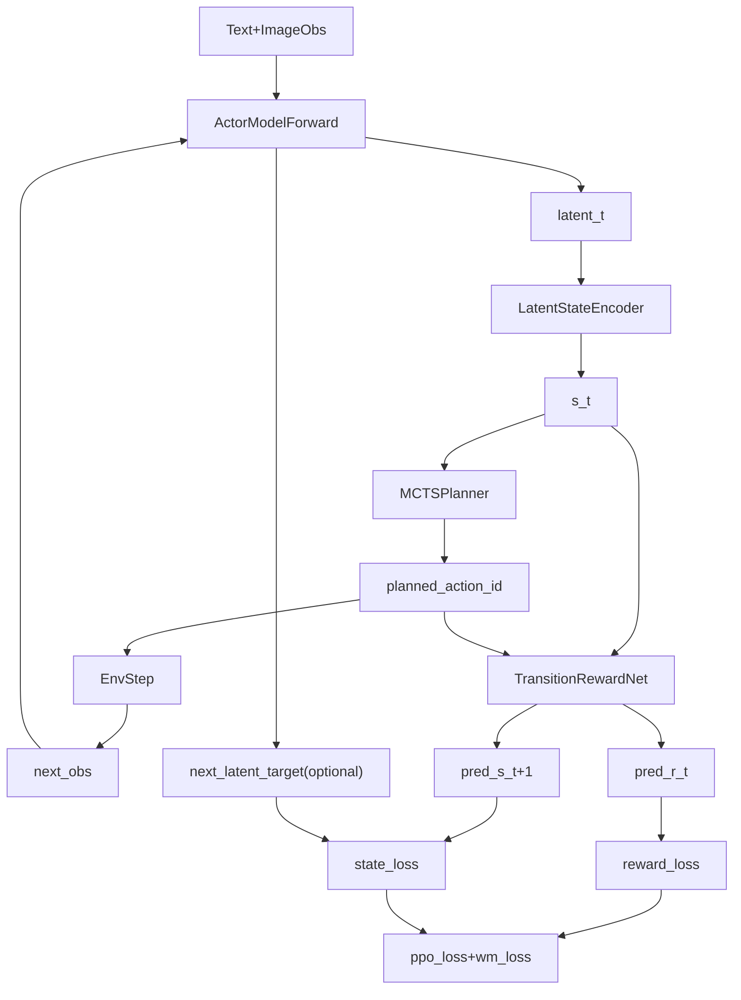

# World Model 代码索引（VAGEN）

面向人类的简要记录：world model（含 latent MCTS）目前主要在 `verl/` 侧实现，`vagen/` 侧负责训练编排与日志。

## 1) 核心代码位置与功能

- `verl/verl/workers/roles/utils/world_model.py`
  - `LatentStateEncoder`：把 LLM latent 压到 world state 空间。
  - `TransitionRewardNet`：输入 `(world_state, action_id)`，预测 `(next_world_state, expected_reward)`。

- `verl/verl/workers/roles/utils/mcts_planner.py`
  - `MCTSPlannerConfig`：MCTS 深度、分支、折扣等超参。
  - `MCTSPlanner.plan()`：基于 `TransitionRewardNet` 做轻量 lookahead，输出 `planned_action_ids`。

- `verl/verl/workers/roles/actor.py`
  - 在 actor 初始化时按配置创建 `state_encoder / transition_reward_net / world_model_optimizer / mcts_planner`。
  - 在 `compute_log_prob()` 中可产出 `world_state` 与 `planned_action_ids`（受开关控制）。
  - 在 `update_actor()` 中参与优化（world model 与策略一起 step）。

- `verl/verl/workers/actor/dp_actor.py`
  - FSDP/DP 路径下的 world model 训练分支。
  - 在有监督字段（`action_labels`、`step_rewards`、`next_latent`）时计算 `reward_loss/state_loss`。

- `verl/verl/workers/roles/utils/losses.py`
  - `ppo_loss()` 内含 world model 可选损失分支（与 PPO 主损失叠加）。
  - 当前已加可观测指标：`actor/world_model_enabled`、`actor/world_model_supervision_missing`、`actor/world_model_loss`。

- `vagen/ray_trainer.py`
  - 训练主循环，消费 actor 返回的 `planned_action_ids`。
  - 记录规划动作摘要指标：`predictor/planned_action_mean/min/max`。

## 2) 关键配置入口

- `vagen/configs/vagen_multiturn.yaml`
  - `actor_rollout_ref.actor.*` 下的 world model / MCTS 参数：
    - `num_actions`
    - `world_state_dim`
    - `transition_hidden_dim`
    - `state_loss_coef`
    - `reward_loss_coef`
    - `action_head_detach_latent`
    - `action_head_lr`
    - `enable_latent_mcts`
    - `mcts.{depth, branching, c_puct, rollout_steps, discount}`

- `verl/verl/workers/config/actor.py`
  - `ActorConfig` 的字段定义与默认值（训练链路最终读取这里）。

## 3) 脚本与运行入口（当前）

项目里没有单独的 “world model 专用脚本”；沿用现有训练脚本，通过配置开关启用。

- 训练入口（Python）
  - `vagen/main_ppo.py`

- 常用训练脚本（示例）
  - `examples/train/.../*.sh`（如 README 中的 sokoban/navigation/frozenlake 训练脚本）

- 建议做法
  - 先用 baseline（`num_actions=0`, `world_state_dim=0`, `enable_latent_mcts=false`）跑通；
  - 再开 predictor/mcts 对照实验，观察以下指标是否出现且正常：
    - `actor/world_model_*`
    - `predictor/planned_action_*`

## 4) 当前状态提示

- world model 主干已经接入训练与日志；
- 若数据中缺少监督字段（如 `action_labels/step_rewards/next_latent`），会出现 `world_model_supervision_missing`，表示分支已启用但监督不足。

## 5) 架构图（Mermaid）

## 6) 数学解释（简要）

设：
- 语言模型在时刻 `t` 的最后隐状态为 `h_t`；
- 编码后的 world state 为 `s_t`；
- 动作为 `a_t`；
- 转移网络输出为 `(\hat{s}_{t+1}, \hat{r}_t)`。

### 6.1 状态编码

- `s_t = E_\theta(h_t)`
- 对应实现：`LatentStateEncoder`

### 6.2 转移与奖励预测

- `(\hat{s}_{t+1}, \hat{r}_t) = T_\phi(s_t, a_t)`
- 对应实现：`TransitionRewardNet`

### 6.3 训练损失（与 PPO 叠加）

- 奖励回归损失：
  - `L_reward = MSE(\hat{r}_t, r_t)`
- 状态转移损失（可选，取决于是否有 `next_latent`）：
  - 先编码目标：`s_{t+1}^* = E_\theta(h_{t+1})`
  - 再回归：`L_state = MSE(\hat{s}_{t+1}, s_{t+1}^*)`
- 总损失形式：
  - `L_total = L_ppo + \lambda_r * L_reward + \lambda_s * L_state`
  - 其中 `\lambda_r`、`\lambda_s` 对应配置里的 `reward_loss_coef`、`state_loss_coef`。

### 6.4 MCTS 规划目标（当前轻量版）

- 给定当前 `s_t`，对候选动作做有限深度 lookahead，近似最大化折扣回报：
  - `a_t^* = argmax_a Q(s_t, a)`
  - `Q(s_t, a) ~= \hat{r}(s_t, a) + \gamma * max_{a'} Q(\hat{s}_{t+1}, a')`
- 当前实现是基于 `TransitionRewardNet` 的 lightweight rollout（不是完整 UCT 树搜索）。
